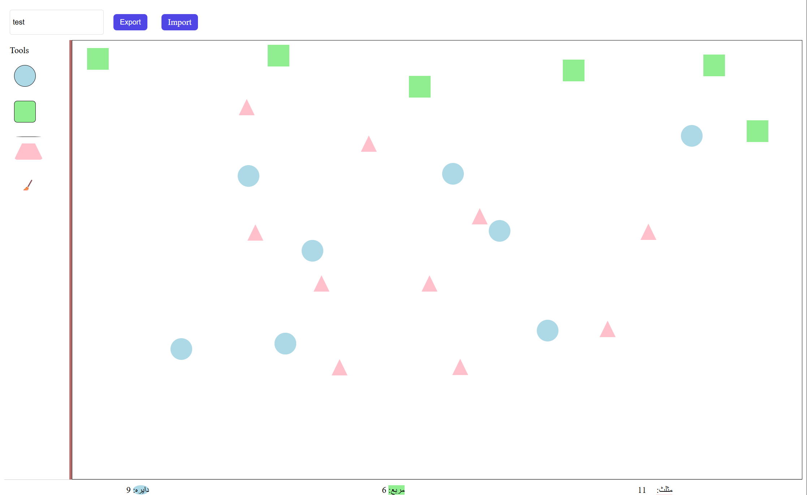

# تمرین دستگرمی 2

یک پروژه ساده و کاربردی برای نقاشی با اشکال هندسی (دایره، مربع، مثلث) در محیط React + TypeScript، با قابلیت Import/Export به JSON، شمارش اشکال، و ابزار پاک‌کن.

در این پروژه یک تخته نقاشی ساده به سه شکل پایه دایره، مربع و مثلث ساختیم. با انتخاب هر شکل و سپس یک بار کلیک بر روی برد نقاشی شکل مورد نظر در آنجا قرار می‌گیرد. در صورتی که بخواهیم شکلی را پاک کنیم ابتدا شکل پاک کن را در سمت راست انتخاب کرده و سپس با دوبار کلیک بر روی یکی از اشکال مربع، دایره یا مثلث آن‌ها را پاک می‌کنیم.

همچنین امکان ذخیره برد نقاشی شده به صورت یک فایل JSON نیز وجود دارد. این کار با استفاده از دکمه export صورت می‌گیرد. برای مشاهده نقاشی‌های پیشین هم می‌توان از دکمه ایمپورت استفاده کرد و با انتخاب یکی از فایل‌های ذخیره شده آن را در برد بازیابی کرد.

## ساختار پروژه:

src/

├── components/

│   ├── Header.tsx         # نوار بالایی شامل عنوان، دکمه‌های Import و Export

│   ├── Sidebar.tsx        # نوار ابزار سمت راست شامل اشکال و ابزار پاک‌کن

│   ├── Canvas.tsx         # بوم نقاشی که شکل‌ها روی آن ترسیم می‌شوند

│   ├── Shape.tsx          # نمایش هر شکل (دایره، مربع، مثلث)

│   └── ShapeCounter.tsx   # نمایش تعداد هر شکل در پایین صفحه

│

├── types/

│   └── index.ts           # تعریف نوع داده‌ها (شکل‌ها، موقعیت، نوع ابزار)

│
├── App.tsx                # مدیریت اصلی وضعیت ابزار، شکل‌ها و ارتباط بین اجزا

├── index.tsx              # نقطه ورود اپلیکیشن

└── styles.css             # استایل کلی پروژه

## نحوه اجرا
```
git clone https://github.com/amirahsh1404/dastgarmi2.git
cd react-shape-painter
npm install
npm run dev
```

## توضیح کدهای هر بخش
### 1. فایل APP.tsx
وطیفۀ اصلی این کلاس نگهداری وضعیت اشکال، ابزار فعال، و عنوان نقاشی است. درواقع مدیریت ایونت‌ها و اتفاقاتی که در سرتاسر برنامه رخ می‌دهد ابتدا در این کلاس مدیریت و سپس به بخش‌های لازم دستورات ارسال می‌شود. متدهای لازم مانند اضافه کردن شکل، پاک کردن یا کارهای مربوط به جیسون در اینجا ابتدا مدیریت می‌شوند.

- ارسال props به کامپوننت‌ها برای تعامل بین آن‌ها
- پیاده‌سازی منطق Import و Export فایل JSON

```
import React, { useState } from 'react';
import Header from './components/Header';
import Sidebar from './components/Sidebar';
import Canvas from './components/Canvas';
import ShapeCounter from './components/ShapeCounter';
import { ShapeData, ShapeType } from './types';
import { v4 as uuidv4 } from 'uuid';
import './styles.css';

type ToolType = ShapeType | 'eraser';

const App: React.FC = () => {
    const [title, setTitle] = useState('');
    const [shapes, setShapes] = useState<ShapeData[]>([]);
    const [selectedTool, setSelectedTool] = useState<ToolType | null>(null);

    const addShape = (x: number, y: number) => {
        if (!selectedTool || selectedTool === 'eraser') return;
        const newShape: ShapeData = {
            id: uuidv4(),
            type: selectedTool,
            x,
            y,
        };
        setShapes(prev => [...prev, newShape]);
    };

    const removeShape = (id: string) => {
        setShapes(prev => prev.filter(shape => shape.id !== id));
    };

    const exportToJson = () => {
        const data = JSON.stringify({ title, shapes }, null, 2);
        const blob = new Blob([data], { type: 'application/json' });
        const url = URL.createObjectURL(blob);
        const link = document.createElement('a');
        link.href = url;
        link.download = `${title || 'painting'}.json`;
        link.click();
    };

    const importFromJson = (e: React.ChangeEvent<HTMLInputElement>) => {
        const file = e.target.files?.[0];
        if (!file) return;

        const reader = new FileReader();
        reader.onload = () => {
            try {
                const data = JSON.parse(reader.result as string);
                if (data.shapes && Array.isArray(data.shapes)) {
                    setTitle(data.title || '');
                    setShapes(data.shapes);
                }
            } catch {
                alert( 'فایل JSON نامعتبر است.');
            }
        };
        reader.readAsText(file);
    };

    return (
        <div className="app">
            <Header
                title={title}
                setTitle={setTitle}
                onExport={exportToJson}
                onImport={importFromJson}
            />
            <div className="main">
                <Sidebar selectTool={setSelectedTool} activeTool={selectedTool} />
                <Canvas
                    shapes={shapes}
                    addShape={addShape}
                    removeShape={removeShape}
                    selectedTool={selectedTool}
                />
            </div>
            <ShapeCounter shapes={shapes} />
        </div>
    );
};

export default App;

```

### 2. فایل‌های پوشه component
در این قسمت کامپوننت‌های مورد نیاز طراحی و پیاده سازی شده اند.
- در Canvas: کلیک روی بوم شکل را در محل کلیک اضافه می‌کند و در حالت پاک‌کن، دابل‌کلیک باعث حذف شکل می‌شود.
- در Header: ورودی عنوان نقاشی، دکمه برای Import فایل JSON (ورود نقاشی) و دکمه برای Export نقاشی فعلی به فایل JSON طراحی شده است.
- در Sidebar: ابزار انتخاب اشکال: دایره، مربع، مثلث، ابزار پاک‌کن: با انتخاب آن، می‌توان با دابل‌کلیک اشکال را حذف کرد و همچنین ابزاری که در آن لحظه فعال است فعال مشخص می‌شود (با کلاس .active)
- در Shape:نمایش شکل در موقعیت مشخص با کلاس CSS متناسب با نوع آن
- در ShapeCounter: شمارش تعداد اشکال روی بوم (دایره، مربع، مثلث)
 مجموعه کدهای این کلاس‌ها به صورت:
```
import React from 'react';
import Shape from './Shape';
import { ShapeData, ShapeType } from '../types';

type Props = {
  shapes: ShapeData[];
  addShape: (x: number, y: number) => void;
  removeShape: (id: string) => void;
  selectedTool: ShapeType | 'eraser' | null;
};

const Canvas: React.FC<Props> = ({ shapes, addShape, removeShape, selectedTool }) => {
  const handleClick = (e: React.MouseEvent<HTMLDivElement>) => {
    const rect = e.currentTarget.getBoundingClientRect();
    addShape(e.clientX - rect.left, e.clientY - rect.top);
  };

  return (
      <div className="canvas" onClick={handleClick}>
        {shapes.map((shape) => (
            <Shape
                key={shape.id}
                shape={shape}
                onDoubleClick={() => {
                  if (selectedTool === 'eraser') {
                    removeShape(shape.id);
                  }
                }}
            />
        ))}
      </div>
  );
};

export default Canvas;

import React from 'react';

type Props = {
  title: string;
  setTitle: (title: string) => void;
  onExport: () => void;
  onImport: (e: React.ChangeEvent<HTMLInputElement>) => void;
};

const Header: React.FC<Props> = ({ title, setTitle, onExport, onImport }) => {
  return (
      <header className="header">
        <input
            type="text"
            value={title}
            onChange={(e) => setTitle(e.target.value)}
            placeholder="Painting Title"
        />
        <button onClick={onExport}>Export</button>
        <label className="import-btn">
          Import
          <input type="file" accept=".json" onChange={onImport} hidden />
        </label>
      </header>
  );
};

export default Header;

import React from 'react';
import { ShapeData } from '../types';

const Shape: React.FC<{ shape: ShapeData; onDoubleClick: () => void }> = ({ shape, onDoubleClick }) => {
  return (
      <div
          className={`shape ${shape.type}`}
          style={{ left: shape.x, top: shape.y }}
          onDoubleClick={onDoubleClick}
      />
  );
};

export default Shape;

import React from 'react';
import { ShapeData } from '../types';

const ShapeCounter: React.FC<{ shapes: ShapeData[] }> = ({ shapes }) => {
    const counts = shapes.reduce<Record<string, number>>((acc, shape) => {
        acc[shape.type] = (acc[shape.type] || 0) + 1;
        return acc;
    }, {});

    return (
        <footer className="counter">
            <div><span className="circle">دایره:</span> {counts.circle || 0}</div>
            <div><span className="square">مربع:</span> {counts.square || 0}</div>
            <div><span className="triangle">مثلث:</span> {counts.triangle || 0}</div>
        </footer>
    );
};

export default ShapeCounter;

import React from 'react';
import { ShapeType } from '../types';

const tools: (ShapeType | 'eraser')[] = ['circle', 'square', 'triangle', 'eraser'];

type Props = {
    selectTool: (tool: ShapeType | 'eraser') => void;
    activeTool: ShapeType | 'eraser' | null;
};

const Sidebar: React.FC<Props> = ({ selectTool, activeTool }) => {
    return (
        <aside className="sidebar">
            <div>Tools</div>
            {tools.map((tool) => (
                <button
                    key={tool}
                    onClick={() => selectTool(tool)}
                    className={`tool ${tool} ${activeTool === tool ? 'active' : ''}`}
                    title={tool === 'eraser' ? 'پاک‌کن' : tool}
                >
                    {tool === 'eraser' ? '🧹' : ''}
                </button>
            ))}
        </aside>
    );
};

export default Sidebar;

```

### 3. فایل‌ style.css
در این فایل هم که دیزاین‌های لازم برای اشکال، دکمه‌ها و موارد دیگر قرار گرفته است:
```
.app {
  display: flex;
  flex-direction: column;
  height: 100vh;
}
.header {
  display: flex;
  gap: 10px;
  padding: 10px;
}
.sidebar {
  width: 100px;
  display: flex;
  flex-direction: column;
  gap: 10px;
  padding: 10px;
  border-right: 5px solid #b66b6b;
}
.main {
  display: flex;
  flex: 1;
}
.canvas {
  flex: 1;
  position: relative;
  border: 1px solid black;
}
.shape {
  width: 40px;
  height: 40px;
  position: absolute;
}
.triangle {
  width: 0;
  height: 0;
  border-left: 15px solid transparent;
  border-right: 15px solid transparent;
  border-bottom: 30px solid pink;
}
.circle {
  border-radius: 50%;
  background: lightblue;
}
.square {
  background: lightgreen;
}

.tool {
  width: 40px;
  height: 40px;
  border: 1px solid black;
}
.tool.triangle {
  background: #ffffff;
  width: 0;
  height: 0;
  border-left: 15px solid transparent;
  border-right: 15px solid transparent;
  border-bottom: 30px solid pink;
}
.tool.eraser {
  font-size: 20px;
  background: white;
  border: none;
}

.counter {
  display: flex;
  justify-content: space-around;
  padding: 10px;
  border-top: 1px solid #ccc;
}
.import-btn input {
  display: none;
}

button {
  padding: 6px 12px;
  margin: 8px;
  border: none;
  border-radius: 6px;
  background-color: #4f46e5;
  color: white;
  cursor: pointer;
  transition: all 0.3s ease;
}
label {
  padding: 6px 12px;
  margin: 8px;
  border: none;
  border-radius: 6px;
  background-color: #4f46e5;
  color: white;
  cursor: pointer;
  transition: all 0.3s ease;
}

button:hover {
  background-color: #4338ca;
}

input {
  padding: 5px;
  border-radius: 4px;
  border: 1px solid #ddd;
}

```

## تصویری از عملکرد
  


